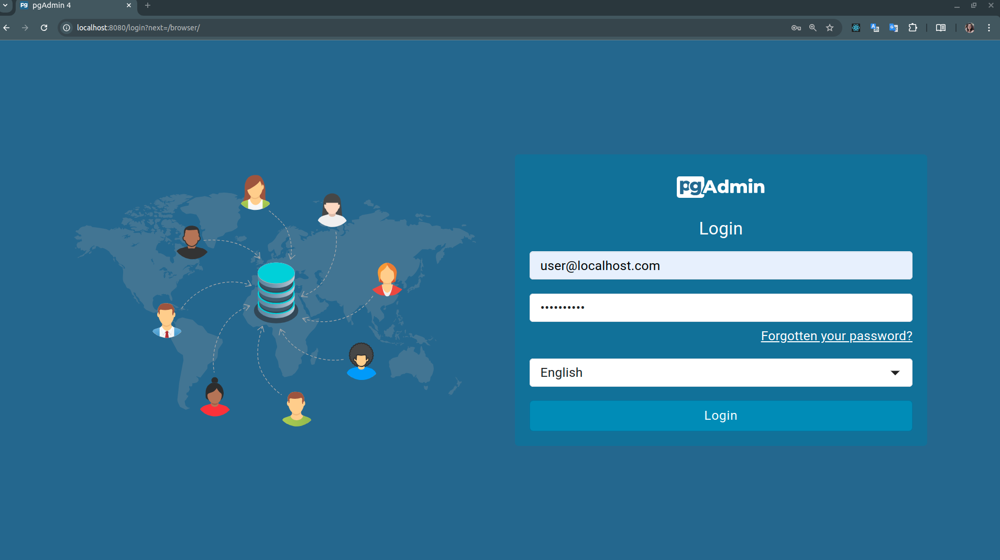
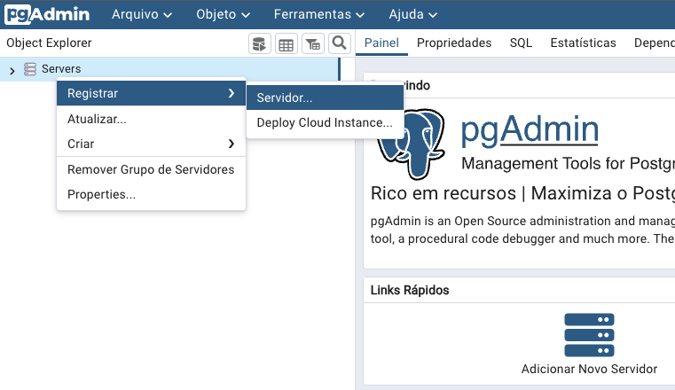
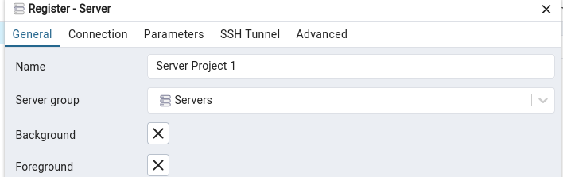
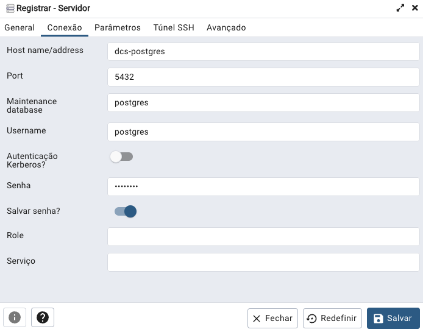
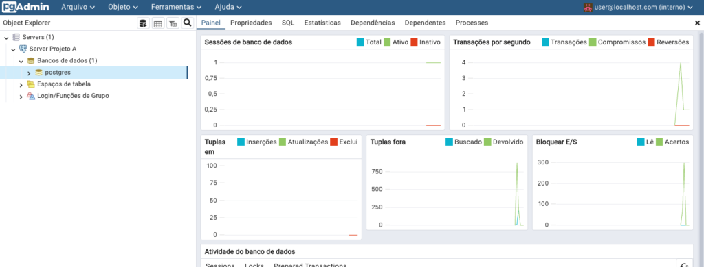
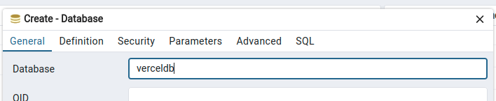
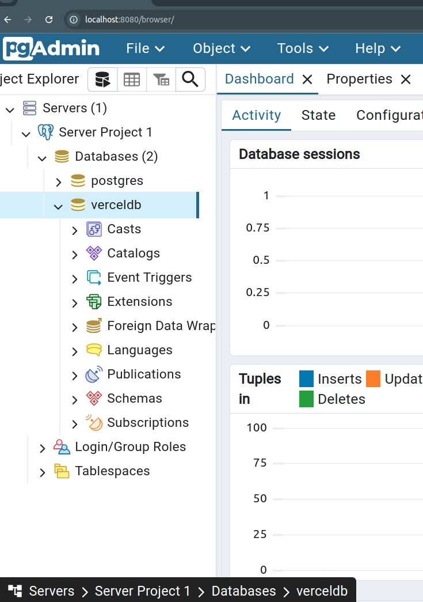

# PostgreSQL and pgAdmin with Docker Compose

#### Docker Compose script to create a local environment for development with PostgreSQL and pgAdmin

### To run this script is necessary:
- docker-compose-example.yml
- setup-docker-even.sh

### Instructions:

1. Save the shell script `setup_docker_env.sh` and make it executable by running:
   ```bash
   chmod +x setup_docker_env.sh   
   ```
   >  ⚠ If you want to change the Docker network name, you should edit the setup_docker_env.sh file and update the global variable NETWORK_NAME.


2. Run script (By using source setup_docker_env.sh, it runs in the same shell session as your terminal, meaning cd will change the directory in the terminal session itself.)
   ```bash
   source setup_docker_env.sh
   ```

3. if case you need to run the shell script by ./setup_docker_env.sh, so,
"please manually change to the 'postgres-env-dev' directory by running":
   ```bash
   cd postgres-env-dev
   ```
4. Whenever you need to work with these tools, just open the terminal in the folder where you added the docker-compose.yml file and run the following command:
   ```bash
   docker-compose -f docker-compose.yml up
   ```  
5. To view the containers, open a new terminal tab and type:
   ```bash
   docker ps
   ```  
6. Verify that the directory being mounted in the container has the correct permissions. In your docker-compose.yml, you're mounting the host directory ./data/pgadmin to /var/lib/pgadmin in the container. Ensure that the user running Docker has read and write permissions for this directory.
   ```bash
   cd postgres-env-dev
   sudo chmod -R 777 ./data/pgadmin/
   ```

>  To test if the pgAdmin service is working, access http://localhost:8080 in your browser. You will see an authentication screen where you should enter the username and password that we set in the Compose file. If you prefer, you can also change the application language.
>


### The screen should look similar to this:



#### Once authenticated, let's add our server and test the connection.


### Adding a Server in pgAdmin

To add a server in pgAdmin, go to the Object Explorer tab, right-click on the "Servers" item, and then select the "Register" and "Server" options. Alternatively, you can use the shortcut available in the quick links.




A window will open for you to configure the server. In the **General** tab, provide a name to identify your connection. In this tutorial, I named it **Server Project 1**.



Move to the **Connection** tab and in the **Host name** field, enter the name of the PostgreSQL container. In the **Username** field, enter the user, and in the respective field, enter the password. Click **Save** to continue.

These values were defined in the docker-compose.yml file



There are also other useful settings, but for this scenario, we'll configure only the essentials to start testing PostgreSQL.

After saving, if you have followed all the steps so far, the result will be a dashboard displaying information about the database you are connected to.



Finally, let's create our database. Right-click on **Databases**. 


Enter a name for your database and click **Save** to continue.



Once finished, in the **Object Explorer** tab, you should see your new database listed.



## Done! We've reached the end, and now you have an environment with PostgreSQL and the pgAdmin web interface. :clap: :rocket:
   
